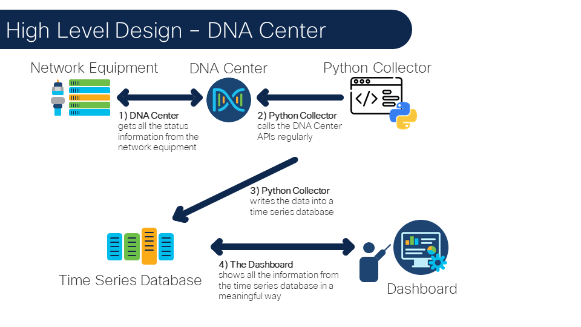
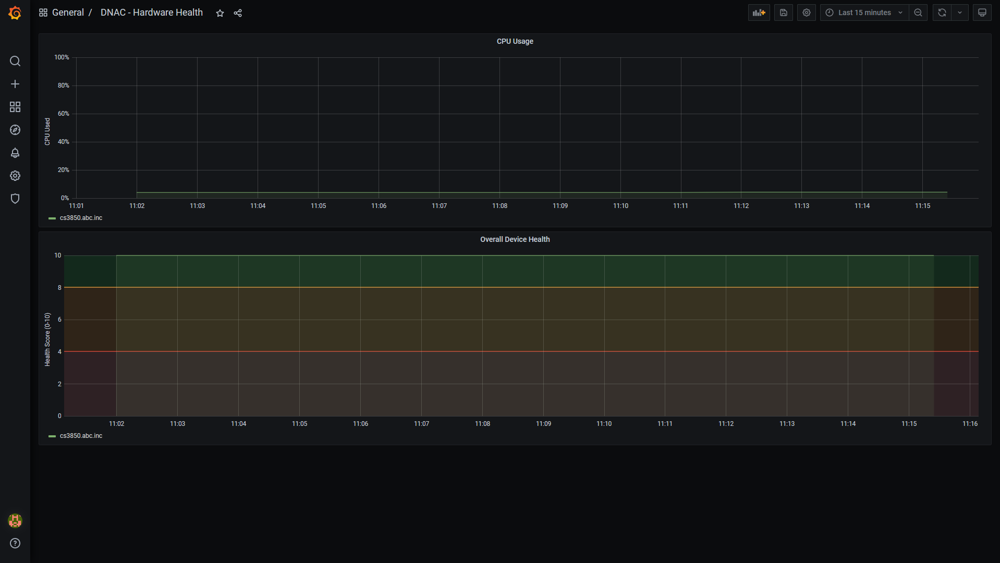
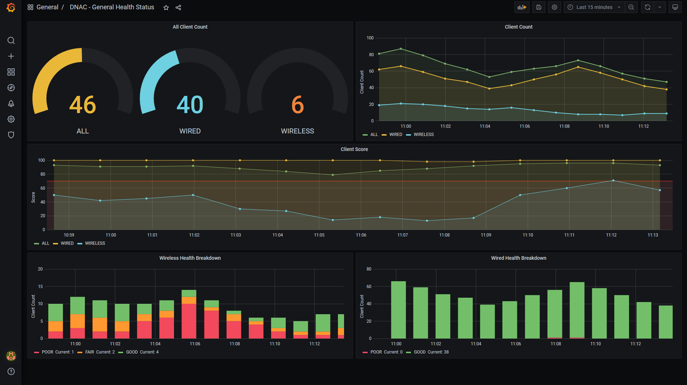

# GVE DevNet DNAC Telemetry Dashboard
> Please note: this repository is based on the repository made by Ignacio Fite called [DNA Telemetry Dashboard](https://wwwin-github.cisco.com/nfitelop/DNA-Telemetry). We have added a few undocumented DNA Center API calls. 
> Please note: using undocumented DNA Center API calls is at your own risk. In case there are any changes, then the API calls might stop working and this will not be communicated in the API change log. No formal support will be provided. 

Cisco DNA Center has a great dashboard that shows a snapshot of your netwerk and device health. The history of the health and telemetry goes up to two weeks, but in some instances, we would like to have a longer history in order to understand the trend. This repository shows how to create dashboard in Grafana that shows the health and telemetry history. The data is stored in InfluxDB. 

The following image illustrates the architecture: 



Screenshots of the dashboard:






## Contacts
* Stien Vanderhallen (stienvan@cisco.com)
* Simon Fang (sifang@cisco.com)
* Kim Gouweleeuw (kgouwele@cisco.com)

## Solution Components
* Python 3
* DNA Center
* Grafana
* InfluxDB

## How to install Grafana
For Grafana, we recommend using `Homebrew`. Follow the instructions below to install Grafana using brew:

1. Open a terminal and enter:

        $ brew update
        $ brew install grafana

2. Start Grafana using the command:
        
        $ brew services start grafana

3. Go to the following url in your browser:

        http://localhost:3000

4. Create an account and save the username and password. You will need to add these credentials to your `.env` file. 


## How to install InfluxDB
Similarly to Grafana, we recommend that you install InfluxDB using the Homebrew package manager. Follow the instructions below to install InfluxDB:

1. Open a terminal and enter:

        $ brew update
        $ brew install influxdb

2. Start InfluxDB by entering the following command in the terminal:

        $ influxd

3. Go to the following url in your browser:

        http://localhost:8086

4. Create an account and save the username and password. You will need to add these credentials to your `.env` file. 

5. Moreover, we also need to create an API token. Head to `Data > API Tokens` and click `Generate API Token > Read/Write API Token`. 

6. Provide a name for the token and select the correct scopes and buckets and click `save`. 

7. Click on the newly created token and copy the token to your clipboard. you will need to add the token to your `.env` file. 

## Installation/Configuration

The following commands are executed in the terminal.

1. Create and activate a virtual environment for the project:
   
        #WINDOWS:
        $ py -3 -m venv [add_name_of_virtual_environment_here] 
        $ [add_name_of_virtual_environment_here]/Scripts/activate.bat 
        #MAC:
        $ python3 -m venv [add_name_of_virtual_environment_here] 
        $ source [add_name_of_virtual_environment_here]/bin/activate
        
> For more information about virtual environments, please click [here](https://docs.python.org/3/tutorial/venv.html)

2. Access the created virtual environment folder

        $ cd [add_name_of_virtual_environment_here]

3. Clone this repository

        $ git clone [add_link_to_repository_here]

4. Access the folder `gve_devnet_dnac_telemetry_dashboard`

        $ cd gve_devnet_dnac_telemetry_dashboard

5. Install the dependencies:

        $ pip install -r requirements.txt

6. Open the `.env` file and add the username and password for your Grafana, InfluxDB and DNAC instances. In addition, you need to add the DNA Center URL. Please consult the previous section on how to obtain this information.

    ```python
        # General Config
        TZ=Europe/Amsterdam

        # Influx Config
        INFLUX_HOST=http://localhost
        INFLUX_PORT=8086
        INFLUX_ORG=Cisco
        INFLUX_DNACBUCKET=dnac
        INFLUX_TOKEN=<INSERT_INFLUX_TOKEN>
        INFLUX_USERNAME=<INSERT_INFLUX_USERNAME>
        INFLUX_PASSWORD=<INSERT_INFLUX_PASSWORD>

        # Grafana Config
        GRAFANA_HOST=http://localhost
        GRAFANA_PORT=3000
        GRAFANA_USERNAME=<INSERT_GRAFANA_USERNAME>
        GRAFANA_PASSWORD=<INSERT_GRAFANA_PASSWORD>

        # Sleep Interval
        SLEEP_INTERVAL=60

        # DNA Centers Configs
        DNACENTER_SANDBOX_URL=<INSERT_DNAC_URL>
        DNACENTER_SANDBOX_USER=<INSERT_DNAC_USERNAME>
        DNACENTER_SANDBOX_PASSWORD=<INSERT_DNAC_PASSWORD>
    ```

## Usage (local)
Now it is time to run your script. Before you do so, make sure that your Grafana, InfluxDB and DNAC instances are running:

1. Start your local InfluxDB instance with the following command in the terminal:

        $ influxd

2. Start your local Grafana instance with the following command in the terminal:

        $ brew services start grafana

3. Run your script by typing in the following the command in the terminal:

        $ python main.py


## Usage (Docker container)

1. Install Docker Desktop [here](https://www.docker.com/products/docker-desktop)

2. Install Docker Compose

```
$ pip install docker-compose
```

3. Clone this repository
```
$ git clone https://www.github.cisco.com/gve-sw/gve_devnet_dna_center_telemetry_dashboard_tig/
```

4. Navigate to the code directory

```
$ cd gve_devnet_dna_center_telemetry_dashboard_tig
```

5. Fill out and rename `app-code/.env_docker` to `.env` with the information obtained above

6. Build application

```
$ docker-compose down
$ docker-compose build
$ docker-compose up -d
```

6. In a browser, navigate to `localhost:3000` to access the Grafana dashboard

### LICENSE

Provided under Cisco Sample Code License, for details see [LICENSE](LICENSE.md)

### CODE_OF_CONDUCT

Our code of conduct is available [here](CODE_OF_CONDUCT.md)

### CONTRIBUTING

See our contributing guidelines [here](CONTRIBUTING.md)

#### DISCLAIMER:
<b>Please note:</b> This script is meant for demo purposes only. All tools/ scripts in this repo are released for use "AS IS" without any warranties of any kind, including, but not limited to their installation, use, or performance. Any use of these scripts and tools is at your own risk. There is no guarantee that they have been through thorough testing in a comparable environment and we are not responsible for any damage or data loss incurred with their use.
You are responsible for reviewing and testing any scripts you run thoroughly before use in any non-testing environment.